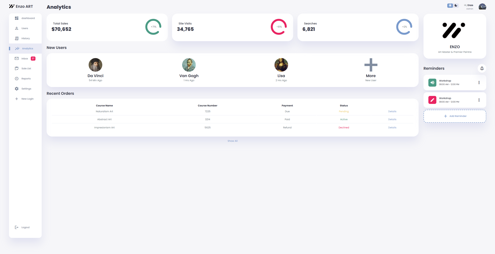

# Admin Dashboard Project



A responsive admin dashboard interface for e-commerce management, featuring light/dark mode toggle and analytics visualization.

## 🔧 Technologies Used


## 🚀 Features
- Responsive layout with CSS Grid/Flexbox
- Light/Dark theme toggle
- Interactive charts and analytics
- User management section
- Order tracking system
- Mobile-friendly design

## 📁 Project Structure
```
Admin-Dashboard/
├── index.html
├── style.css
├── script.js
├── orders.js
└── image/
    ├── logo.png
    ├── plus.png
    ├── user 1.png
    ├── user 2.png
    ├── user 3.png
    └── wallpaper.png
```

## 🛠️ Customizations Made
- Replaced all original tutorial assets with custom images
- Updated color scheme in CSS variables
- Modified user profile section layout
- Added additional analytics metrics

## ⚠️ Disclaimer
This project was created by following the tutorial from **[ASMR Programming - Responsive Admin Dashboard](https://www.youtube.com/watch?v=YJTKlAvbDo4)**. 

Modifications made include:
- Replacement of all visual assets (images/icons)
- Minor CSS adjustments for personal preference
- Custom user data entries

The core functionality and base code structure remain from the original tutorial.

## 📄 License
MIT License - see [LICENSE](LICENSE) for details
